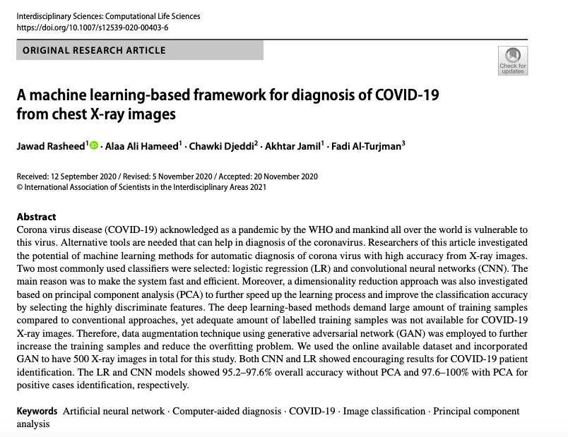

```{r xaringan-themer, include=FALSE, warning=FALSE}
library(xaringanthemer)
style_mono_light(
  base_color = "#042856", 
  header_color = "#7cacd4",
  title_slide_text_color = "#7cacd4",
  link_color = "#0000FF",
  text_color = "#000000",
  background_color = "#FFFFFF",
  header_h1_font_size ="2.00rem"
  )
```

```{r, echo=FALSE, purl=FALSE, message = FALSE}
knitr::opts_chunk$set(results='hide', comment = "#>", purl = FALSE)
```

class: left

# Outline

* What is Data Science?
* Why R/RStudio?
* Introduction to R/RStudio basics.
* Introduction to RMarkdown.

---

# What is Data Science?

* According to [Wikipedia](https://en.wikipedia.org/wiki/Data_science): 
  * Data science is an **interdisciplinary** field that uses scientific methods, processes, algorithms, and systems to extract knowledge and insights from data in various forms, both structured and unstructured.

 * Data science is a **concept to unify statistics, data analysis, machine learning, and their related methods** to **understand and analyze actual phenomena** with data. 

 * It employs techniques and theories drawn from many fields within the context of **mathematics**, **statistics**, **information science**, and **computer science**.

---
class: middle, center

```{r echo=FALSE, results='asis', out.height='100%', out.width='60%', fig.cap='Introduction to Statistics', fig.align='center'}
 
```

---
- **Definition of data** has been changed since then...

--

```{r echo=FALSE, results='asis', out.height='100%', out.width='55%', fig.align='center'}
 
```

---
- One reason why Data Science is so **popular now** is the **big volumes** of **structured/unstructured** data produced by the following tech companies:

--

.pull-left[
  ```{r echo=FALSE, results='asis', out.height='100%', out.width='100%'}
  
```
]

--

.pull-right[
```{r echo=FALSE, results='asis', out.height='100%', out.width='100%', fig.cap='A minute on the internet in 2020', fig.align='center'}
 
```
]

---
class: middle, center

```{r echo=FALSE, results='asis', out.height='100%', out.width='70%', fig.cap='Structured vs Unstructured data', fig.align='center'}
 
```

---
- According to [Lawtomated](https://lawtomated.com/structured-data-vs-unstructured-data-what-are-they-and-why-care/), unstructured data comes from:     
  - **Social Media:** YouTube, Instagram, Twitter.
  - **Mobile data:** text messages, locations.
  - **Media:** MP3, digital photos, audio recordings and video files.
  - **Satellite imagery:** atmospheric images, geographic forms, military movements.
  - **Scientific data:** oil and gas exploration, space exploration, and seismic imagery.
  
---
- According to [DataRobot](https://www.datarobot.com/wiki/data-science/) (rephrased version of [Wikipedia](https://en.wikipedia.org/wiki/Data_science) definition):
  - Data science is the field of study that combines **domain expertise**, **programming skills**, and knowledge of **mathematics** and **statistics** to extract meaningful insights from data. 
 - Data science practitioners apply machine learning algorithms to **numbers, text, images, video, audio, and more** to produce artificial intelligence (AI) systems to perform tasks that ordinarily require human intelligence. 
 - In turn, these systems generate insights which analysts and business users can translate into tangible **business value**.
---
class: middle, center


```{r echo=FALSE, results='asis', out.height='100%', out.width='90%', fig.cap='Data Science', fig.align='center'}
 
```

---
class: middle, center

```{r echo=FALSE, results='asis', out.height='100%', out.width='70%', fig.cap='Data Scientist', fig.align='center'}
 
```

---
class: middle, center


```{r echo=FALSE, results='asis', out.height='100%', out.width='70%', fig.align='center'}
 
```

---

```{r echo=FALSE, results='asis', out.height='100%', out.width='80%', fig.cap='Mind Map of Data Science Courses', fig.align='center'}
 
```


---

- "Peck plays the guitar, harmonica, kazoo, maracas, and drums (with ropes attached to his shoes, wrist and the guitar head) simultaneously AND sings."

```{r echo=FALSE, results='asis', out.height='100%', out.width='30%', fig.link='https://www.flickr.com/photos/randychiu/4602851011/', fig.align='center'}
 
```


---
class: middle, center

```{r echo=FALSE, results='asis', out.height='100%', out.width='100%', fig.link='https://yapayzeka.itu.edu.tr/', fig.align='center'}
 
```

---
class: middle, center

```{r echo=FALSE, results='asis', out.height='100%', out.width='100%', fig.align='center'}
 
```

[İTÜ YZV Ders Planı](https://www.sis.itu.edu.tr/TR/ogrenci/lisans/ders-planlari/plan/YZVE/000000.html)

---

```{r echo=FALSE, results='asis', out.height='100%', out.width='75%', fig.link= "https://www.ucl.ac.uk/news/2021/feb/ucl-partners-facebook-ai-research-deliver-phd-programme", fig.align='center'}
 
```

- "In the coming year four UCL PhD students will join the new research AI programme; each of the UCL students will be assigned FAIR mentors based at the FAIR London site, well known for its work in **3D computer vision**, knowledge intensive and multilingual **Natural Language Programming **(NLP), and **reinforcement learning** (RL)."


---
class: middle, center

```{r echo=FALSE, results='asis', out.height='100%', out.width='100%', fig.link="https://www.microsoft.com/en-us/research/collaboration/bair/", fig.align='center'}
 
```

---
class: middle, center

```{r echo=FALSE, results='asis', out.height='100%', out.width='90%', fig.link="https://www.amazon.science/academic-engagements/usc-and-amazon-establish-center-for-secure-and-trusted-machine-learning", fig.align='center'}
 
```
---
class: middle, center

# Some Real-World Data Science Examples

---
class: middle, center

.pull-left[
```{r echo=FALSE, results='asis', out.height='100%', out.width='140%'}
  
```

[Covid-19](https://pubmed.ncbi.nlm.nih.gov/33387306/)
]


--

.pull-right[
```{r echo=FALSE, results='asis', out.height='100%', out.width='100%', fig.align='center'}
 
```
]

---
class: middle, center

```{r echo=FALSE, results='asis', out.height='100%', out.width='80%', fig.link="https://news.stanford.edu/2020/05/21/mapping-dry-wildfire-fuels-ai-new-satellite-data/", out.width='80%'}
  
```

[Wildfire](https://news.stanford.edu/2020/05/21/mapping-dry-wildfire-fuels-ai-new-satellite-data/)

---
class: middle, center

```{r echo=FALSE, results='asis', out.height='40%', out.width='10%', fig.link="https://journals.sagepub.com/doi/abs/10.1177/08944393211010398", out.width='80%'}
  
```

[Court Decision](https://journals.sagepub.com/doi/abs/10.1177/08944393211010398)

---
class: middle, center

```{r echo=FALSE, results='asis', out.height='5%', out.width='5%', fig.link="https://assets.amazon.science/69/8d/2249945a4e10ba8fc758f7523b0c/getting-your-package-to-the-right-place-supervised-machine-learning-for-geolocation.pdf", out.width='80%'}
  
```

[Amazon package delivery](https://assets.amazon.science/69/8d/2249945a4e10ba8fc758f7523b0c/getting-your-package-to-the-right-place-supervised-machine-learning-for-geolocation.pdf)

---
class: middle, center 

# When Data Science goes wrong

---
# Algorithmic bias

.pull-left[
```{r echo=FALSE, results='asis', out.height='100%', out.width='80%'}
 
```
]

.pull-left[
- "Algorithmic bias describes **systematic and repeatable errors** in a computer system
that create **unfair outcomes**, such as privileging one arbitrary groups of users over others." -[Wikipedia](https://en.wikipedia.org/wiki/Algorithmic_bias)

- "Machine learning bias generally stems from problems introduced by the individuals who design and/or train the machine learning systems. These individuals could either **create algorithms** that reflect **unintended cognitive biases** or **real-life prejudices**. Or the individuals could introduce biases because they use **incomplete, faulty or prejudicial data sets** to train and/or validate the machine learning systems." -[Margaret Rouse](https://searchenterpriseai.techtarget.com/definition/machine-learning-bias-algorithm-bias-or-AI-bias)
]
---
.pull-left[

<blockquote class="twitter-tweet"><p lang="en" dir="ltr">‘Orwellian’ AI lie detector project challenged in EU court — this one claims to determine honesty of immigrants through facial expressions. Absolutely insane stuff. <a href="https://t.co/AmmPHuhMap">https://t.co/AmmPHuhMap</a></p>&mdash; Eryk Salvaggio (@e_salvaggio) <a href="https://twitter.com/e_salvaggio/status/1357934812175233025?ref_src=twsrc%5Etfw">February 6, 2021</a></blockquote> <script async src="https://platform.twitter.com/widgets.js" charset="utf-8"></script>
]

--
.pull-right[
- EU-funded research project using artificial intelligence for facial “lie detection” with the aim of **speeding up immigration checks**.
- The research in question is controversial because the notion of an accurate lie detector machine remains science fiction, and with good reason: There’s no evidence of a **“universal psychological signal”** for deceit.
]

---
.pull-left[
```{r echo=FALSE, results='asis', out.height='100%', out.width='80%'}
  
```

```{r echo=FALSE, results='asis', out.height='100%', out.width='80%'}
  
```

[Voice reconigition](https://www.scientificamerican.com/article/how-speech-recognition-software-discriminates-against-minority-voices/)
]

--
.pull-right[
 - The growth of this tech in the past decade—not just **Siri** but **Alexa** and **Cortana** and others—has unveiled a problem in it: **racial bias**.
- "Koenecke points to the most likely: the **data used for training**, which are predominantly from **white, native speakers of American English**. By using databases that are narrow both in the words that are used and how they are said, **training systems exclude accents and other ways of speaking that have unique linguistic features**." 
- On average, the authors found, all five programs from leading technology companies, including Apple and Microsoft, showed significant **race disparities**; they were roughly **twice as likely to incorrectly transcribe audio from Black speakers** compared with white speakers.
- This effectively censors voices that are not part of the **standard languages** or accents used to create these technologies.
- For someone with a **disability** who is dependent on these technologies, **being misunderstood** could have serious consequences. 
]
---
class: middle, center

# How can we avoid algorithmic bias?

---
```{r echo=FALSE, results='asis', out.height='100%', out.width='60%'}
  
```

- Magaret Mitchell wrote a paper about AI safety and ethical concerns related to language models such as GPT3 and BERT. 

---

- " ...human beings cannot overcome all forms of bias. But slowing down and learning
what those traps are -as well as how to recognize and challenge them- is critical."  Yael Eisenstat (CIA analyst, diplomat and national security advisor at the White House).

- Several ways to **avoid bias**:
  - Data management.
  - Choice of algorithm.
  - Transparency.
  - Diverse data science teams.
  - Speak out!.. 
  

---
class: middle, center

```{r echo=FALSE, results='asis', out.height='100%', out.width='70%'}
  
```

---
class: middle, center

```{r echo=FALSE, results='asis', out.height='100%', out.width='70%', fig.link="https://www.youtube.com/watch?v=jZl55PsfZJQ"}
  
```

---
# Attributions
- All images used in this slide are taken from the web.
- Some part of this lecture note is developed through following sources:
   - [Data Science Labs](https://datasciencelabs.github.io/pages/lectures.html) and
   - [Data Science for Beginners](https://bookdown.org/BaktiSiregar/data-science-for-beginners/).

