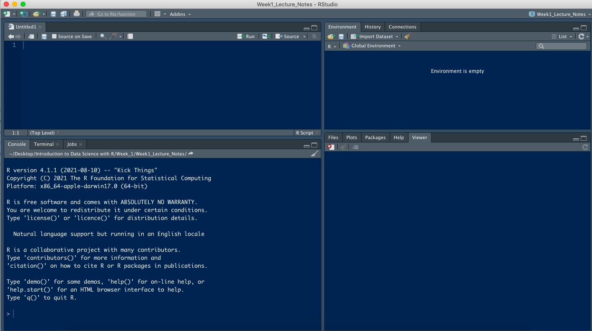

```{r xaringan-themer, include=FALSE, warning=FALSE}
library(xaringanthemer)
style_mono_light(
  base_color = "#042856", 
  header_color = "#7cacd4",
  title_slide_text_color = "#7cacd4",
  link_color = "#0000FF",
  text_color = "#000000",
  background_color = "#FFFFFF",
  header_h1_font_size ="2.00rem"
  )
```


```{r, echo=FALSE, purl=FALSE, message = FALSE}
knitr::opts_chunk$set(comment = "#>", purl = FALSE)
```

class: center, middle

# Introduction to R/RStudio

                    


---

# What is R? What is RStudio?

-  [R](https://cran.r-project.org/) is a **statistical software environment** allowing us to perform a wide variety of **data analysis** and to do **visualization** and to develop **new statistical algorithms**. 
-  The term `R` is used to refer to both the **statistical programming language** to write scripts and the **software ("environment")** that interprets the scripts written in `R`. 

---
-  `R` can be run entirely by **typing commands** on the **R console** that executes commands as you type them.


```{r echo=FALSE, out.height='70%', out.width='75%', fig.align='center'}

```

---
-  `R` has **no graphical user interface**, which means there are no buttons to click and no dropdown menus. 

-  [RStudio](https://www.rstudio.com/) is an
**Integrated Development Environment** (IDE) for working with `R`, so that we can access our scripts and data, find help, and preview plots and outputs **all in one place**.


```{r echo=FALSE, out.height='75%', out.width='75%', fig.align='center'}

```

---
# Attractive features of R
- `R` is **free**.

---
- `R` is **open source**. 
  - It is easy for others to **contribute add-ons** which enables developers to share software implementations of new data science methodologies. 

--

```{css echo=FALSE}
.pull-left {
  float: left;
  width: 30%;
}
.pull-right {
  float: right;
  width: 70%;
}
```

.pull-left[
```{r echo=FALSE, out.width='80%'}
  
```
]


.pull-right[
```{r echo=FALSE, out.width='200%'}
  
```

[sars2pack](https://www.healthit.gov/techlab/ipg/node/4/submission/2936)
]

---
- `R` is **open source**. 
   - **Anyone can inspect the source code** to see how `R` works. Because of this
     transparency, there is less chance for mistakes, and if you (or someone else)
     find some, you can report and fix bugs.
     
--
  
```{r echo=FALSE, out.height='70%', out.width='60%'}
  
```

[PGEE](https://cran.r-project.org/web/packages/PGEE/index.html)

---

- `R` code is **reproducible**.
- **Reproducibility** is when someone else (including your future self) can obtain the
  **same results** from the **same dataset** when using the **same analysis**.
   - Are the tables and figures reproducible from the code and data?
   - Does the code actually do what you think it does?
   - Can you extend the code to do other things?

---

.pull-left[
```{r echo=FALSE}
  
```
[Reproducibility](https://www.nature.com/news/1-500-scientists-lift-the-lid-on-reproducibility-1.19970)
]

--

.pull-right[
- More than 70% of researchers have tried and **failed to reproduce another scientist's experiments**, and more than half have failed to reproduce their own experiments.
- 73% said that they think that **at least half of the papers in their field can be trusted**, with physicists and chemists generally showing the most confidence.
]

---
- A side note: There is a very interesting document on **Reproducibility**.
  Check this out please!
  
       https://michaelmccarthy.netlify.app/talk/osssg-2021a/.
   
---

- `R` works on data of all **shapes** (e.g., tabular, text, spatial, graph, image data and so on).

--

```{css echo=FALSE}
.pull-left {
  float: left;
  width: 40%;
}
.pull-right {
  float: right;
  width: 60%;
}
```

.pull-left[
```{r echo=FALSE, out.height='90%', out.width='100%'}
  
```
]
--
.pull-right[
```{r echo=FALSE, out.height='100%', out.width='100%'}
  
```
]
 
---
```{css echo=FALSE}
.pull-left {
  float: left;
  width: 50%;
}
.pull-right {
  float: right;
  width: 50%;
}
```

- R can **connect to spreadsheets, databases**, and many other data formats, on your
computer or on the web.


.pull-left[
```{r echo=FALSE, out.height='150%', out.width='100%'}
  
```
]
--
.pull-right[
```{r echo=FALSE, out.height='150%', out.width='100%'}
  
```
]

---
```{css echo=FALSE}
.pull-left {
  float: left;
  width: 50%;
}
.pull-right {
  float: right;
  width: 50%;
}
```

.pull-left[
```{r echo=FALSE, out.height='100%', out.width='100%'}
  
```
]
--
.pull-right[
 ```{r echo=FALSE, out.height='100%', out.width='100%'}
  
 ```
]


---
- `R` produces **high-quality graphics**.
   - The plotting functionalities in `R` are endless, and allow you to adjust any
aspect of your graph to convey most effectively the message from your data.
   - Many press media prefer `R`.

--

```{css echo=FALSE}
.pull-left {
  float: left;
  width: 50%;
}
.pull-right {
  float: right;
  width: 50%;
}
```

.pull-left[
```{r echo=FALSE, out.height='100%', out.width='90%'}
  
```
]
--
.pull-right[
 ```{r echo=FALSE, out.height='100%', out.width='80%'}
  
 ```
]


---

- `R` is **interdisciplinary**.
  - With 10,000+ packages that can be installed to extend its capabilities, `R`
provides a framework that allows you to combine statistical approaches from many
scientific disciplines including ecology, molecular biology, social sciences, and geography to best suit the analytical framework you need to analyze your data. 

---
- `R` community is **supporting**.
   - There is a **large, growing, and active community** of `R` users and, as a result, there are numerous resources for learning and asking questions.
   - If possible, try to give a  **reproducible example** for your problem (along with your platform information the versions of `R` and
the packages that you are using, and other information that can be very helpful
to understand your problem).

---

   -  Many of them are willing to help you through:
      -  [RStudio Community](https://community.rstudio.com/),
      -  [Stack Overflow](https://stackoverflow.com/questions/tagged/r), and
      -  On [Twitter](https://twitter.com/home) with hastag #rstats.
 
   - If your question is about a specific package, see if there is a [GitHub](https://github.com/) repository for it. If it is so, file an issue then.

--
.pull-right[
```{r echo=FALSE, out.height='100%', out.width='80%'}
  
```
] 


---
```{css echo=FALSE}
.pull-left {
  float: left;
  width: 50%;
}
.pull-right {
  float: right;
  width: 50%;
}
```

# Who to follow on Twitter?

.pull-left[
```{r echo=FALSE, out.height='100%', out.width='100%'}
knitr::include_graphics('images/hadley.png')  
```
]
--
.pull-right[
```{r echo=FALSE, out.height='100%', out.width='100%'}
  
```
]


---
```{css echo=FALSE}
.pull-left {
  float: left;
  width: 50%;
}
.pull-right {
  float: right;
  width: 50%;
}
```

# Who to follow on Twitter?

.pull-left[
```{r echo=FALSE, out.height='100%', out.width='100%'}
  
```
]
--
.pull-right[
 ```{r echo=FALSE, out.height='100%', out.width='100%'}
  
 ```
]

---
# Who to follow on Twitter?

.pull-left[
```{r echo=FALSE, out.height='100%', out.width='100%'}
  
```
]

--
.pull-right[
```{r echo=FALSE, out.height='50%', out.width='100%'}
  
```
]

---
# Last but not least
- `R` is **accessible**.

--

```{css echo=FALSE}
.pull-left {
  float: left;
  width: 50%;
}
.pull-right {
  float: right;
  width: 50%;
}
```

.pull-left[
```{r echo=FALSE, out.height='50%', out.width='80%'}
  
```
]
--
.pull-right[
```{r echo=FALSE, out.height='100%', out.width='100%'}
  
```
]

---
- I highly suggest you to watch the talk of JooYoung entitled **"Accessible Data Science Beyond Visual Models: Non-Visual Interactions with `R` and `RStudio` Packages"**  recently streamed at [RStudio Global 2021](https://rstudio.com/conference/):

[Accessiblity Video](https://rstudio.com/resources/rstudioglobal-2021/accessible-data-science-beyond-visual-models-non-visual-interactions-with-r-and-rstudio-packages/?wvideo=2akpqwob93)

---
- **Maybe turn is yours!..**

```{css echo=FALSE}
.pull-left {
  float: left;
  width: 50%;
}
.pull-right {
  float: right;
  width: 50%;
}
```

.pull-left[
```{r echo=FALSE, out.height='50%', out.width='80%'}
  
```
]
--
.pull-right[
```{r echo=FALSE, out.height='100%', out.width='100%'}
  
```
]

---
# Attributions

- All images used in this slide are taken from the web.
- Some part of this lecture note is developed through following sources:
   - [Cengel](https://github.com/cengel/R-intro/),
   - [Our Coding Club](https://ourcodingclub.github.io/tutorials/intro-to-r/), and
   - [Duke Stat](https://www2.stat.duke.edu/courses/Fall19/sta199.001/slides/lec-slides/01-meet-toolkit.html#1).

 

