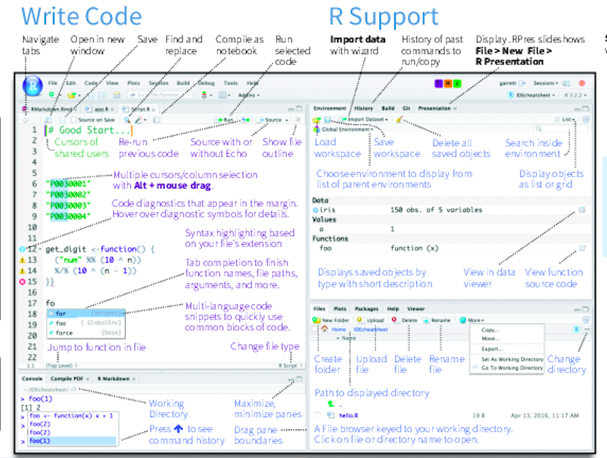
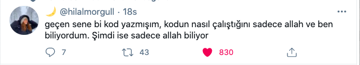
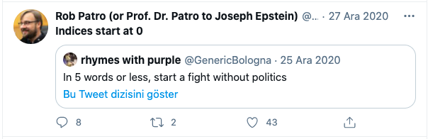

```{r xaringan-themer, include=FALSE, warning=FALSE}
library(xaringanthemer)
style_mono_light(
  base_color = "#042856", 
  header_color = "#7cacd4",
  title_slide_text_color = "#7cacd4",
  link_color = "#0000FF",
  text_color = "#000000",
  background_color = "#FFFFFF",
  header_h1_font_size ="2.00rem"
  )
```

```{r, echo=FALSE, purl=FALSE, message = FALSE}
knitr::opts_chunk$set(comment = "#>", purl = FALSE)
```

class: center, middle

# R Basics

---
```{r}

```

# Knowing your way around RStudio

- The `RStudio` IDE a free open-source product (under the
[Affero General Public License (AGPL) v3](https://www.gnu.org/licenses/agpl-3.0.en.html)).

- We will use `RStudio` as a graphical front-end to `R`, so that we can access our scripts and data, find help, and preview plots and outputs all in one place.

- To function correctly, `RStudio` needs `R` and therefore **both** need to be installed on your computer. 

   - You can download the recent version of `R` from [CRAN](https://cran.r-project.org/). Select the link appropriate for your operating system.

   - Then, download  the recent version of `RStudio` from the [RStudio](https://www.rstudio.com/) (select the free open source desktop version).

   - If you are using a Mac, in addition to `R` and `RStudio`, you need to download [XQuartz](https://www.xquartz.org/).

- Visit [R/RStudio set up video](https://tutorials.shinyapps.io/00-setup/). 

---
```{css echo=FALSE}
.pull-left {
  float: left;
  width: 50%;
}
.pull-right {
  float: right;
  width: 50%;
}
```

- `RStudio` is divided into 4 "Panes" (small windows): 
   - The **Source** for your scripts and documents  (top-left, in the default layout), 
   - The R **Console** (bottom-left), 
   - Your **Environment/History** (top-right), and 
   - Your **Files/Plots/Packages/Help/Viewer** (bottom-right). 

---
class: middle, center

```{r echo=FALSE, out.width='70%', fig.cap='RStudio Interface'}

```

---
# How to start an R project?

- It is **always good practice** to keep a set of related data and analyses in **a single folder**. 

  * Start `RStudio`.
  * Under the `File` menu, click on `New project`, choose `New directory`, then
  `New project`.
  * As directory (or folder) name enter `r-intro` and create project as sub-directory of your desktop folder: `~/Desktop`.
  * Click on `Create project`.
  * Under the `Files` tab on the right of the screen, click on `New Folder` and
  create a folder named `data` within your newly created working directory (e.g., `~/r-intro/data`).
  * On the main menu go to `Files` > `New File` > `R Script` to open a new file and
  * Save the empty script as `r-intro-script.R` in your working directory.

---
- A quick side note: If you are interested in file management/data science work flow, I suggest you to read the following article:

       http://www.rebeccabarter.com/blog/2019-03-07_reproducible_pipeline/.


---
- If you need to check which working directory `R` thinks it is in:

```{r eval=FALSE}
getwd()
[1] "/Users/gulinan/Desktop/r-intro"
```

- To set a different working directory in `R` go to the `Console` and type:

```{r eval=FALSE}
setwd("Path/To/Your/Newworkingdirectory")
```

---
# RStudio Console and Command Prompt

- The console pane in `RStudio` is the place where **commands written** in the `R`
language can be **typed** and **executed** immediately by the computer.
- It is also where
the **results will be shown** for commands that have been executed. 
- You can type
commands directly into the console and press <kbd>`Enter`</kbd> to execute those commands, but they will be **forgotten when you close the session**.
- If `R` is ready to accept commands, the `R` console by default shows a `>` prompt.
- If it
receives a command, `R` will try to execute it, and when
ready, will **show the results** and come back with a new `>` prompt to wait for new
commands.
- If `R` is **still waiting** for you to enter more data because it isn't complete yet,
the console will show a `+` prompt.

---
# RStudio Script Editor
- Because we want to keep our code and workflow properly, it is better to type
the commands in the **script editor**.
- We can create a new `R` script as follows: `File > New File > R Script` and then **save the script**.
- We can now write **commands** directly in the `R Script`.

```{r eval=FALSE}
getwd()
[1] "/Users/gulinan/Desktop/r-intro"
```

- The command on the current line in the
script (indicated by the cursor) or all of the commands in the **currently
selected text** will be sent to the console and executed when you press
<kbd>`Ctrl`</kbd> + <kbd>`Enter`</kbd> (<kbd>`Cmd`</kbd> +
<kbd>`Enter`</kbd> on Mac). 

---
#  Creating objects in R
- To **create an `R` object**, we need to give it a name followed by the
assignment operator `<-` and the value we want to give it:

```{r, purl=FALSE}
my_age <- 25
```

- `<-` is the **assignment operator** and as name suggests it assigns values on the right to objects on
the left. 
- You can also use `=`
for assignments, but not in every context (there are
[slight](http://blog.revolutionanalytics.com/2008/12/use-equals-or-arrow-for-assignment.html) [differences](https://web.archive.org/web/20130610005305/https://stat.ethz.ch/pipermail/r-help/2009-March/191462.html)).
```{r, eval=F, echo=F}
#more on history of assignment operator
#https://www.roelpeters.be/the-difference-between-arrow-and-equals-assignment-in-r/
#https://developer.r-project.org/equalAssign.html
```

- Just a note: What are known as `objects` in `R` are known as `variables` in many other
programming languages.  Depending on the context, `object` and `variable` can
have drastically different meanings.  However, in this lesson, the two words are
used synonymously. 

---
# How to name objects in R?
- Object names must start with a letter or a dot (if you start a name with a dot, the second character cannot be a number).
- Names should contain only letters, numbers, underscore characters (_), and dots (.).
- Objects can be given any name such as `x`, `current_temperature`, or
`subject_id`. 
- Object names should be **explicit** and **not too long**. 
- R is **case sensitive**
(e.g., `weight_kg` is different from `Weight_kg`). 
- There are some names that
cannot be used because they are the names of fundamental functions in `R` (e.g., `if`, `else`, `for`, see
[here](https://stat.ethz.ch/R-manual/R-devel/library/base/html/Reserved.html) for a complete list). 
- In general, even if it is allowed, it's **best to not use other function names** (e.g., `c`, `T`, `mean`, `data`, `df`, `weights`). If in doubt, check the help to see if the name is already in use. 
- It's also best to
avoid dots (`.`) within a variable name as in `my.dataset`. There are many
functions in R with dots in their names for historical reasons, but because dots have a special meaning in `R` (for methods) and other programming languages, it is best to avoid them. 

---
- When assigning a value to an object, `R` does not print anything. 
- We can force `R` to print the value by **using parentheses** or by **typing the object name**:

```{r, purl=FALSE}
weight_kg <- 55    # doesn't print anything
```

```{r, purl=FALSE}
(weight_kg <- 55)  # but putting parenthesis around the call prints the value of `weight_kg`
weight_kg          # and so does typing the name of the object
```
- Now that `R` has `weight_kg` in memory, we can do arithmetic with it. 
- For instance, we may want to convert this weight into pounds (weight in pounds is 2.2 times the weight in kg):

```{r, purl=FALSE}
weight_kg * 2.2 
```

---
# Comments

```{r echo=FALSE, out.height='100%', out.width='80%'}
  
```

--

- The **comment character** in `R` is hashtag (`#`).
- Anything to the right of a `#` in a script
will be ignored by `R`. 
- If you only want to comment
out one line, you can put the cursor at any location of that line (i.e. no need 
to select the whole line), then press <kbd>Ctrl</kbd> + <kbd>Shift</kbd> + 
<kbd>C</kbd>.
- `RStudio` makes it easy to comment or uncomment a paragraph: after selecting the
lines you  want to comment, press at the same time on your keyboard
<kbd>Ctrl</kbd> + <kbd>Shift</kbd> + <kbd>C</kbd>. 

---

# Modes 
- Objects in `R` are classified according to their basic structure which is called as **modes**. 
- Table below shows the **most common ones**. 

```{r variable-modes, echo=FALSE}
#more on quotes
#https://stat.ethz.ch/R-manual/R-patched/library/base/html/Quotes.html
Name <- c("numeric", "character", "logical")
Example <- c("`1`, `3`, `48`",
            "`Steve'`, `'a'`, `'78'`",
            "`TRUE`, `FALSE`")
knitr::kable(x = tibble::tibble(Name, Example), 
      align = c("l", "l"))
```
-  For characters we can either use `" "` or `' '`. 

---
# Data types

- `R` has a number of different **data types**. 
-  Table below shows the ones you're most likely to come across (taken from [this source](https://www.statmethods.net/input/datatypes.html)): 

```{r data-types, echo=FALSE}
Name = c("vector", "matrix", "array", "data frame", "list") 
Description = c(
  "list of values with of the same variable mode",
  "2D data structure",
  "same as matrix for higher dimensional data",
  "matrices in that different columns can have different modes",
  "flexible type that can contain different variable types with diffrent lenghts"
  )
knitr::kable(x = tibble::tibble(Name, Description), 
      align = c("l", "l"))
  
```
---
# Vectors 
- A vector is **composed by a series of values** where all of the values are the **same type of data**.
- We build vectors using the **concatenate function** `c()`.  

```{r}
weight_g <- c(21, 34, 39, 54, 55)  # make a vector
weight_g
```

- You can use the `c()` function to add other elements to your vector:

```{r, results='show', purl=FALSE}

weight_g <- c(weight_g, 90) # add to the end of the vector
weight_g
weight_g <- c(30, weight_g) # add to the beginning of the vector
weight_g
```


---
- The function `str()` provides an overview of the internal **str**ucture of an `R` object and its
elements. 
- It is a useful function when working with large and complex
objects:

```{r, results='show', purl=FALSE}
str(weight_g)
```

- The function `class()` indicates the class (the type of element) of an object:

```{r, results='show', purl=FALSE}
class(weight_g)
```

- Note: `class` is a property assigned to an object that determines how **functions** operate with it.

---
- A vector can also contain **characters**:

```{r, purl=FALSE}
animals <- c("mouse", "rat", "dog", "frog")
class(animals)
```
- A vector can also contain **logical values** (the boolean data type).

```{r, purl=FALSE}
has_tail <- c(TRUE, TRUE, TRUE, FALSE)
class(has_tail)
```


---


```{r echo=FALSE, out.height='100%', out.width='80%'}
  
```

--

- `R` **indices start at 1**. 
-  Programming languages like `Fortran`, `MATLAB`, `Julia`, and `R` start
counting at 1, because that's what human beings typically do. 
-  Languages in the `C` family (including `C++`, `Java`, `Perl`, and `Python`) **count from 0** because that's simpler for computers to do.
---

# Subsetting vectors

- If we want to **extract one or several values from a vector**, we must provide one
or several indices in square brackets ([]). 

```{r, results='show', purl=FALSE}
animals[2]
animals[c(3, 2)]
```

- The **colon operator** `:` is a special operator that **creates numeric vectors of integers** in increasing
or decreasing order, test `1:10` and `10:1` for instance. 
- We can use this to select a sequence, like this: 

```{r, results='show', purl=FALSE}
animals[2:4]
```

---

- You can **exclude** elements of a vector using the "`-`" sign:

```{r, results='show', purl=FALSE}
animals[-2]
animals[-c(1:3)]
```

- We can also repeat the indices to create an object with more elements than the
original one:

```{r, results='show', purl=FALSE}
more_animals <- animals[c(1, 2, 3, 2, 1, 4)]
more_animals
```
---
# Comparison Operators

- Table below shows the **comparison operators** that result in logical outputs. 

```{r echo=FALSE, out.width='80%', fig.show='hold'}
knitr::include_graphics(c('images/comparison.png'))
```

- The double equal sign `==` is a test for
numerical equality between the left and right hand sides, and should not be
confused with the single `=` sign, which performs variable assignment (similar
to `<-`).

---
# Boolean Operators

- Table below shows the **Boolean operators** that are used to narrow or broaden search outputs. 

```{r  echo=FALSE, out.width='80%', fig.show='hold'}
knitr::include_graphics(c('images/boolean.png'))
```

---

# Conditional subsetting

- Another common way of subsetting is by using a logical vector. 
- `TRUE` will
select the element with the same index, while `FALSE` will not.

```{r, results='show', purl=FALSE}
animals
logical_index <- c(TRUE, TRUE, TRUE, FALSE)
animals[logical_index]
```

- Typically, these logical vectors are not typed out by hand, but are the output of
other functions or logical tests. 

---
- We can select only the weights above 50:
```{r, results='show', purl=FALSE}
weight_g
weight_g > 50    # will return logicals with TRUE for the indices that meet the condition
## so we can use this to select only the values above 50
weight_g[weight_g > 50]
```

- We can combine multiple tests using `&` (both conditions are true, AND) or `|`
(at least one of the conditions is true, OR):

```{r, results='show', purl=FALSE}
weight_g[weight_g < 30 | weight_g > 50]
weight_g[weight_g >= 30 & weight_g <= 90]
```

---
- The **(in) operator** `%in%` is very useful for searching **certain strings in a vector**.

```{r data-10}
x <- c(1, 2, 3)
2 %in% x  #is 2 in x vector
c(3, 4) %in% x #is elements of c(3, 4) available in x vector
animals
animals %in% c("rat", "cat", "dog") #is elements of animals vector available in that vector
```

---
# Some often used functions 

```{r, out.width="80%", echo=FALSE}
Name = c(
"`length()`",
"`dim()`",
"`seq()`",
"`rep()`",
"`max()`",
"`min()`",
"`which.max()`",
"`which.min()`",
"`mean()`",
"`median()`",
"`sum()`",
"`var()`",
"`sd()`"
)
Description = c(
"length of an object",
"dimensions of an object (e.g. number of rows and columns)",
"generate a sequence of numbers",
"repeat something n times",
"maximum",
"minimum",
"index of the maximum",
"index of the maximum",
"mean",
"median",
"sum",
"variance",
"standard deviation"
)
knitr::kable(x = tibble::tibble(Name, Description), 
      align = c("l", "l"))
```

---
# Missing data

-  **Missing data** is represented as `NA`.
-  When doing operations on numbers, most functions will return `NA` if the data
you are working with include missing values. 
-  We can add the argument `na.rm = TRUE` to calculate the result **while ignoring
the missing values**.

```{r, results='show', purl=FALSE}
heights <- c(2, 4, 4, NA, 6)
max(heights)
sum(heights)
max(heights, na.rm = TRUE)
sum(heights, na.rm = TRUE)
```

---
- If the data include missing values, we may want to become familiar with the
functions `is.na()`, `na.omit()`, `complete.cases()`. 

```{r, results='show', purl=FALSE}
# Extract elements which are not missing values.
heights
!is.na(heights)
heights[!is.na(heights)]
```

---
```{r, results='show', purl=FALSE}
# Extract elements which are not missing values.
na.omit(heights)
# Extract elements which are complete cases.
heights[complete.cases(heights)]
```


---
# Matrix 
- If we arrange data elements of a vector in a **two-dimensional rectangular layout**, then we have a **matrix**. 
- To construct a matrix, we use a function conveniently called `matrix()`.

```{r}
y <- matrix(data = c(1:20), nrow = 5, ncol = 4) # generates 5 x 4 numeric matrix
y
```

- We can subset a matrix with [row `,` column]:

```{r}
y[,4]       # 4th column of matrix
y[3,]       # 3rd row of matrix
```

---
```{r}
y[-1, ] # a matrix which excludes the first row
y[2:4,1:3]  # rows 2,3,4 of columns 1,2,3
```

- Note how we use an **empty placeholder** to indicate that we want to **select all the values** in a row or column, and `-` to indicate that we want to **remove** something.

---
# Array 

- Arrays work the same was as matrices with data of **more than two dimensions**. 

---
# Data frame
- Data frames in `R`, are  matrix type data types which can have elements of any type, but they have to **all be of the same length**.
- A data frame is the most common way of storing tabular data in `R` and something you will likely deal with a lot. 
- As a first approximation, which holds true, probably in the most cases, you can really think of it as a table or a spreadsheet.  
- We use `data.frame()` function to construct a data frame.

```{r}
mydf <- data.frame("ID" = c(1:4),
                   "Color" = c("red", "white", "red", NA),
                   "Passed" = c(TRUE,TRUE,TRUE,FALSE),
                   "Weight" = c(99, 54, 85, 70),
                   "Height" = c(1.78, 1.67, 1.82, 1.59))
mydf
```
---
- We can access the elements of a data frame as in matrix:

```{r}
mydf[1, 2]   # a single element using numbers
mydf[, 1]    # first column in the data frame (as a vector)
mydf[3, ]    # the 3rd row (as a data.frame)
mydf[, -1]   # the whole data frame, excluding the first column
```
---
- As well as using numeric values to subset a `data.frame` (or `matrix`), columns
can be accessed by name:

```{r}  
mydf[, "ID"]  # all IDs
mydf$ID    #all IDs  #<<   
mydf$Color[2] # color of the second one
```

---
# Some often used functions 

```{r, out.width="80%", echo=FALSE}
Name = c(
"`dim()`",
"`nrow()`",
"`ncol()`", 
"`head()`", 
"`tail()`", 
"`colnames()`", 
"`rownames()`", 
"`str()`",
"`summary()`"
)
Description = c(
"returns dimensions of   the object", 
"returns the number of rows",
"returns the number of columns",
"shows the first 6 rows",
"shows the last 6 rows",
"returns the number of columns",
"returns the number of rows",
"structure of the object",
"summary statistics for each column"
)
knitr::kable(x = tibble::tibble(Name, Description), 
      align = c("l", "l"))
```

---
- Here is a list of
functions to get a sense of the content/structure of the data. 
- Size:

```{r}
dim(mydf)  #returns a vector with the number of rows in the first element,
            #and the number of columns as the second element (the **dimensions of
            #the object)
nrow(mydf)  #returns the number of rows
ncol(mydf)  #returns the number of columns
```
---
- Content:
```{r}
head(mydf)  #shows the first 6 rows
tail(mydf) #shows the last 6 rows
```    
---
- Names:
```{r}
colnames(mydf)  #returns the column names
rownames(mydf)  #returns the row names
```  
---
- Summary:
```{r}
str(mydf)  #structure of the object and information about the class, length and
	        # content of  each column
summary(mydf) #summary statistics for each column
```  

- Note: most of these functions are "generic", they can be used on other types of
objects besides `data.frame`.

---
# Some other used functions 

```{r, out.width="80%", echo=FALSE}
name = c(
"`glimpse()`",
"`distinct()`",
"`count()`"
)
description = c(
"data is shown in a transposed way with columns as rows",
"shows all the distinct values for a character or factor column",
"shows a count of all the different distinct values in a column"
)
knitr::kable(x = tibble::tibble(name, description), 
      align = c("l", "l"))
```
---
# List
- Lists can have elements of any type with **different lengths**. 
- We use the `list()` function to construct lists:

```{r}
myl <- list("school"="ITU", "a_vector"=animals, "age"=5.3) # example of a list with 3 components
myl
```
---
```{r}
myl[["school"]] # component named id in list
myl[[2]] # 2nd component of the list
myl[[2]][1]  # 1st component of the 2nd component of the list
```
---

# Extending R base functionality
- `R` comes with a **base system** and **some contributed core packages**. This is what you just downloaded. 
- The functionality of `R` can be significantly extended by using **additional contributed packages**. 
- Those packages typically contain commands (functions) for more specialized tasks. 
- They can also contain example datasets. 

---
# Installing additional packages
- To install additional packages there are two main options:

  - We can use the `RStudio` interface like this:

```{r install-packages, echo=FALSE, out.width='20%', fig.show='hold'}
knitr::include_graphics(c('images/installpckg1.png', 'images/installpckg2.png'))
```
---

 - We can install from the `R` console like this:

```{r eval=FALSE}
# to install a package called "lubridate", for example: (more on this later)
install.packages("lubridate", dependencies = TRUE)
```

### Make use of the installed packages
- In order to **actually use commands** from the installed packages we also  need to **load** the installed packages. 

```{r eval=FALSE}
library(lubridate)
```
or
```{r eval=FALSE}
require(lubridate)
```

- The difference between the two is that `library` will result in an error, if the library does not exist, whereas `require` will result in a warning.

---
# Seeking help
-  One of the most **immediate ways to get help** is to use the `RStudio` help interface:

```{r use-help, echo=FALSE, out.width='30%'}
knitr::include_graphics('images/rstudiohelp.png')
```

- In the default configuration this panel by default can be found at the lower right hand panel of `RStudio`. 
- As seen in the screenshot, by typing the word "Mean", `RStudio` tries to also give a number of suggestions that you might be interested in. The description is then shown in the display window.

---
- If you need help with a specific function, let's say `barplot()`, you can type:
```{r, eval=FALSE, purl=FALSE}
?barplot
```

- on `R console`.

- If you just need to remind yourself of the names of the arguments, you can use:
```{r, eval=FALSE, purl=FALSE}
args(lm)
```

- If you are looking for a function to do a particular task, you can use the
`help.search()` function, which is called by the double question mark `??`.
However, this only looks through the installed packages for help pages with a
match to your search request
```{r, eval=FALSE, purl=FALSE}
??kruskal
```
- If you can't find what you are looking for, you can use
the [rdocumentation.org](http://www.rdocumentation.org) website that searches
through the help files across all packages available.


---
background-image: url('images/google.png')
background-size: 80%
---

- More:
  - [R Cheat Sheet](https://rstudio.com/wp-content/uploads/2016/10/r-cheat-sheet-3.pdf)
  - [RStudio Interface Cheat Sheet](https://rstudio.com/wp-content/uploads/2016/01/rstudio-IDE-cheatsheet.pdf).

---
# Attributions

- All images used in this slide are taken from the web.
- This lecture note is mainly developed through following sources:
   - [Cengel](https://github.com/cengel/R-intro/), 
   - [Our Coding Club](https://ourcodingclub.github.io/tutorials/intro-to-r/), and
   - [Duke Stat](https://www2.stat.duke.edu/courses/Fall19/sta199.001/slides/lec-slides/01-meet-toolkit.html#1).
  
---
# Appendix


```{r  echo=FALSE, out.width='80%', fig.show='hold'}
knitr::include_graphics(c('images/vector.png'))
```


